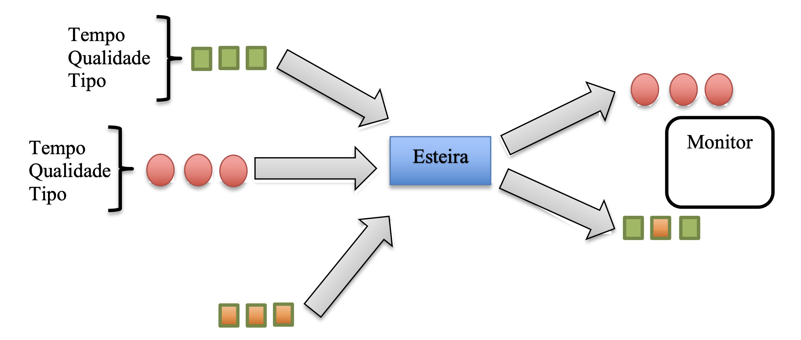
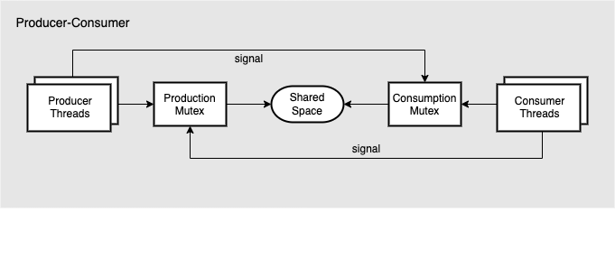
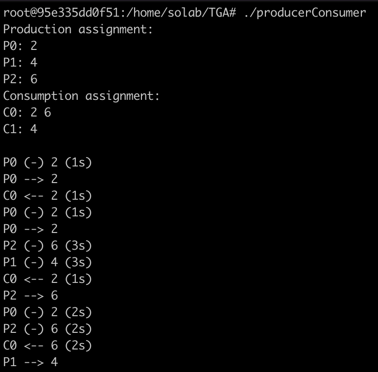

# producer-consumer-mutex

Producer-Consumer implementation in C language using threads and mutex.

Application developed as workpaper for the Operational Systems class.
University of Vale do Rio dos Sinos, Brazil/Rio Grande do Sul

## Description

### Problem
The project should simulate the producer-consumer problem, production processes should generate a product with a defined value for it in a random generated time. Each consumer should be responsible for a specific product, being able to handle more than on type in case there are more producers than consumers in the system. All generated products should be put in a common space where the assigned consumer for it will pick it later and removing it in a random generated time lower than the production one.

### Solution
The application will use 2 mutexes in order to avoid concurrency in the shared space for all threads, the access in the shared space will be then synchronised, letting only one thread of producers/consumers access it per time.

### Output
The program will output the result during execution according to the following:
  * Production assignment: value of each product that the assigned producer will output
  * Consumption assignment: product assignment for each consumer
  * P0 (-) 2 (1s): producer number 0 produced a product with value 2 in 1 second
  * P1 --> 4: producer number 1 moved his product to the shared space
  * C2 <-- 4 (2s): consumer number 2 removed the product with value 4 from the shared space in 2 seconds

